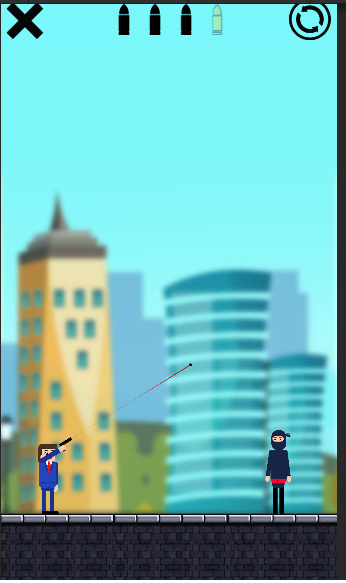

# Mr.-Bullet

Merhaba, Mr. Bullet oyununun tanıtım yazısına hoş geldiniz. Ben, yani Emirhan Dur tarafından Unity oyun motoru ile geliştirilmiştir. Aslında bir tutorial'ı takip ederek geliştirdim fakat durup durup "Bu adam bunu niye böyle yapıyor ya?" diye düşünüp, beğenmeyip kodu değiştirdiğim için bir nevi kendim de geliştirdim sayılabilir.

Oyunumuz böyle bir giriş ekranı ile bizi karşılıyor.

Böyle bir level selection ekranımız var. Basit bir de level selection system'i var. Bölümleri geçtikçe yenisi açılıyor, playerprefs kullandım.

Ardından da veee işte karşımızda oyun. Solda biz, karşımızda ise düşmanımız yer alıyor. Sol üstte ana menüye dönme, sağda ise bölümü yenileme butonu var. Ortada kaç mermimiz kaldığını gösteriyor. 4 mermi ile başlıyoruz ve ilk mermimiz altın.

Ekrana basılı tuttuğumuz zaman karakterimizin kolu hareket ederek nişan alıyoruz. Kırmızı bir line renderer ve crosshair bastığımız yeri takip ediyor.

Basılı tutmayı bıraktığımız zaman ise ateş ediyoruz, kırmızı line renderer ve crosshair'imiz kaybolup yerlerini trail renderer'lı kurşunumuza bırakıyor. Ateş sesi de bize eşlik ediyor. Kurşun yere çarptığı zaman sekiyor. Şimdi düşmana ateş edelim.

Sahnedeki tek düşman kendisi ve onu da öldürdüğümüz için hemen bizi bölüm geçme ekranı karşılıyor, ama ondan düşmanın ölmesini inceleyelim. Kurşunumuz düşmana çarptığı yerden delip geçerek bir kan particle effect'i bırakıyor. Jointlerle oluşturulmuş basit bir 2D Ragdoll sayesinde, düşmanımız gerçek hayatı simüle edecek şekilde hayatını kaybediyor.

Ardından bölüm geçme ekranı beliriyor. Eğer ilk mermimiz ile öldürürsek 3 yıldız alıyoruz, ikinci mermi ile öldürürsek 2 ve bu şekilde azalıyor. Ana menüye dönme, bölümü yeniden oynama ve yeni levela geçme butonlarını kullanabiliriz.

Bölümleri daha da renkli hale getirmek için objelerimiz var ama hepsini teker teker açıklayarak zamanınızı almak istemiyorum. Sadece TNT'yi açıklayacağım.

Kendisi adı üstünde bir patlayıcı. Dinamik olarak değiştirebileceğiniz bir patlama alanı var. Alan içindeki düşmanları öldürüyor ve objeler ile düşmanları patlamanın etkisiyle uçuruyor. Ayrıca hoş bir particle effect'i de var!
